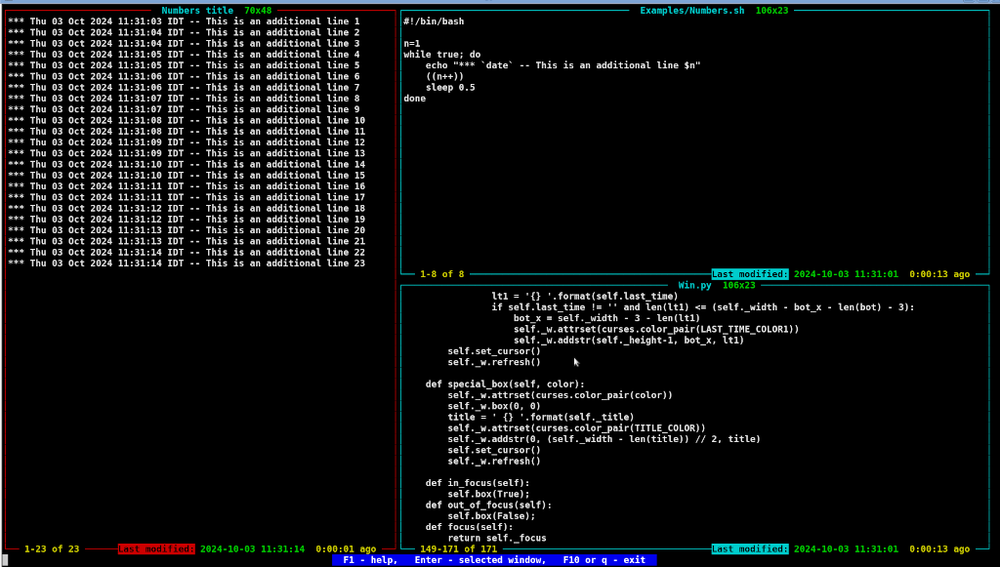
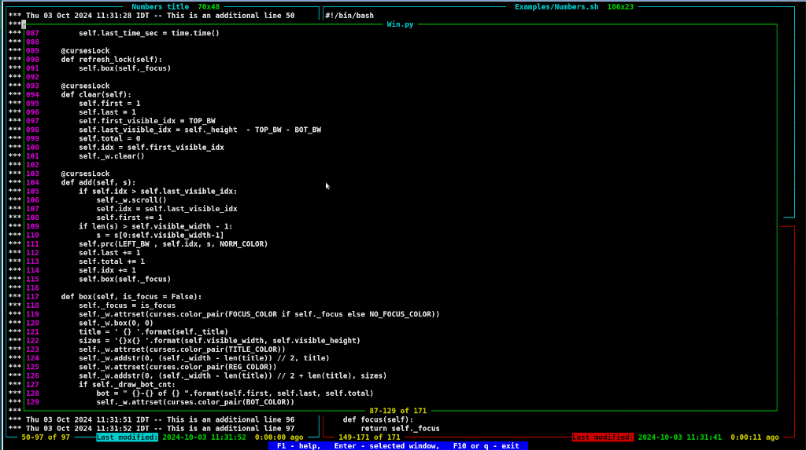

# ntail - multiwindow tail

## General description
The tool is wathing a few files (like "**tail -f**") simultaneously, each file
in its own ncurses based window and shows a few last lines of each file

In an addition one of the above window may be selected and the whole file may be presented in popup window while the basic navigation (_Up/Down/PgUp/PgDown_, etc.) is available in that popup window.

## Internal help and navigation
The tool provides navigation between windows as well as a navigation inside popup window. You can always press **F1** to get internal help message as a popup window

## Configuration
The configuraion of the files, windows, etc. can be specified in a json file (-conf option) or in a command line using -grid and -win options. See Examples/conf.json file for detailed option description. Note that all the option configured in the json file may be specified in a command line. If a json configuration file is specified ntail tools doesn't accept another configuration (via -win/-grid flags).

### Config file configuration
Please see **Examples/conf1.json** file as an configuration example. All configuration details and parameters are descripbed there.

### Command line configuration
Use ntail with -h command line option (**ntail -h**) to get detailed command line description.

## Screenshots
### A few windows with a different files

### Details window for the selected file
